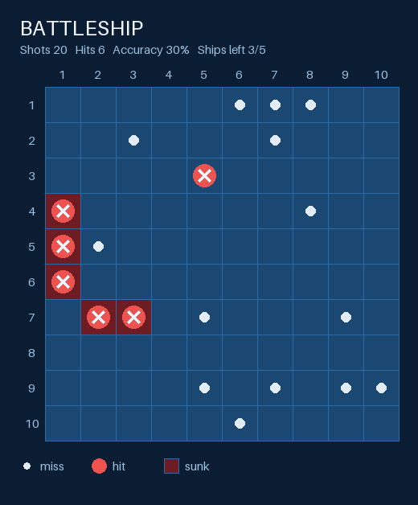
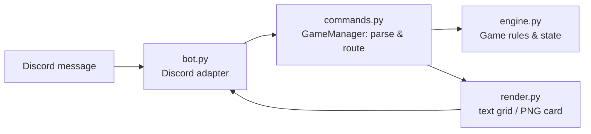

# Battleship Bot

[](https://github.com/HarishRagavendra07/battleship-bot/actions/workflows/ci.yml)


Play Battleship against a bot in Discord. The bot hides a fleet on a 10x10 grid.
You call your shots in chat, and after every shot it replies with a picture of the board.

<p align="center"></p>

## Commands

| Command | What it does |
|---|---|
| `bb help` | Show the rules and commands |
| `bb start` | Start a new game |
| `bb shoot r,c` | Fire at row `r`, column `c` (1–10), e.g. `bb shoot 3,7` |
| `bb surrender` | Give up and reveal where the fleet was |

After every shot the bot says whether it was a **miss**, a **hit** or a **sunk ship** and shows the updated board.
When you sink the last ship it congratulates you and shows your shot count and accuracy.
Each player gets their own game in each channel, so several people can play at the same time.

## Features

- ✅ All required user stories: help, start, shoot, board after each shot, win message
- ✅ Bonus: `bb surrender`
- ✅ Bonus: the board is drawn as a picture with Pillow (set `BB_BOARD_STYLE=text` for a plain-text grid instead)
- The game refuses repeat shots, out-of-range coordinates and a second `bb start` while a game is still running, and tells you why
- 240+ tests and linting run in GitHub Actions on Python 3.11–3.13

## Architecture

The game logic knows nothing about Discord. Each layer has one job, so the core can be tested without a network connection:



| Module | Responsibility |
|---|---|
| [`engine.py`](src/battleship/engine.py) | Places ships randomly without overlaps, resolves shots, tracks win/lose. Plain Python with no I/O. |
| [`render.py`](src/battleship/render.py) | Draws a `Game` as a monospace grid or as a PNG card |
| [`commands.py`](src/battleship/commands.py) | Turns `bb ...` messages into a `Reply` and keeps one game per player |
| [`bot.py`](src/battleship/bot.py) | About 50 lines of discord.py glue that pass messages in and send replies (and images) back |

This split means the same `GameManager` could run a Slack bot or a terminal version without changes.

## Running it yourself

### 1. Create a Discord bot
1. Go to the [Discord Developer Portal](https://discord.com/developers/applications) → **New Application**.
2. Open **Bot**, click **Reset Token** and copy the token.
3. On the same page, turn on **Message Content Intent**. The bot needs it to read `bb` commands.
4. Open **OAuth2 → URL Generator** and tick the `bot` scope plus these permissions: *Send Messages*, *Attach Files*, *Read Message History*.
   Open the generated URL to invite the bot to your server.

### 2. Install and run
```bash
git clone https://github.com/HarishRagavendra07/battleship-bot.git
cd battleship-bot
python -m venv .venv && source .venv/bin/activate
pip install -e ".[dev]"

cp .env.example .env    # then paste your token into DISCORD_TOKEN
battleship-bot          # or: python -m battleship
```

Type `bb start` in any channel the bot can see.

## Development

```bash
pytest          # run the test suite
ruff check .    # lint
python scripts/make_sample_card.py   # regenerate docs/sample-board.png
```

## License

[MIT](LICENSE)
